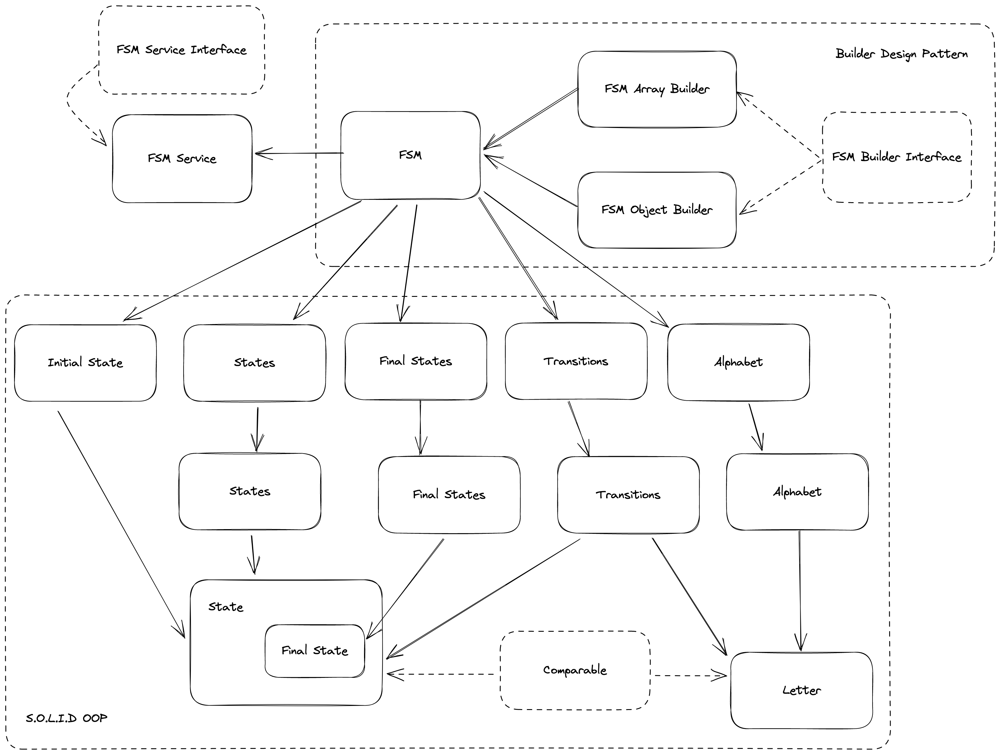

# Finite State Machine

## Table of Content
* [Overview](#overview)
* [Demo](#demo)
* [Technical Aspect](#technical-aspect)
  * [Design Diagram](#design-diagram)
  * [Tech Skills](#tech-skills)
  * [Requirement](#requirement)
  * [File Structure](#file-structure)
  * [Class Structure](#class-structure)
  * [Procedure](#procedure)
* [Tests](#tests)


## Overview
Create a software module for generating an FSM (Finite State Machine). The API of the library is designed for use by other developers. The library(class) is fully test covered. The 'mod-three' procedure is the demo for the FSM. 

## Demo

### Installation and Executing Instruction
1. Require php v8.1 and composer v3
2. Run `composer install` on project root
3. Under project directory, `cd example`, then `php mod_three.php`

### Demo examples
1. Use FSM Array Builder to initiate FSM, then start FSM Service
2. Call Service `processList` with letter list to reproduce the 2 examples from the instruction document
   1. `reset` the FSM after the first example
3. Use FSM Object Builder to initiate another FSM, then start FSM Service with new FSM instance
4. Call Service `processList` a 24 digit binary number for heavier testing


## Technical Aspect

### Requirement
- PHP 8.1
  - Xdebug (for code coverage)
- composer
- PHPUnit

### Design Diagram



### Tech Skills
- Fully Object-Oriented Programming
- Fully follow SOLID principle
- Unit Testing (100% code coverage)
- Builder Design Pattern
- Object Interface and Inheritance

### File Structure

- `/src` is the core library
- `/tests` is the PHPUnit test suite
- `/example` is the example/demo of the FSM by implementing mod-three procedure

### Class Structure

- FSM: the finite state machine
  - FSM:
    - FSM: The main FSM client, this is designed as a Model, only storing the essential data sets
    - FSM Array Builder: Build FSM object by setting essential data in batch (array)
    - FSM Object Builder: Build FSM object by inserting essential data individually
    - FSM Service: The main service for the App, it has process and reset functionalities
  - Alphabet: Letter object set
    - Letter: Accepting letter in FSM, implemented Comparable interface
  - States: State object set
    - State: Accepting state with its name, implemented Comparable interface
  - FinalStates: FinalState objects set, extended from States
    - FinalState: Accepting state with its name and output, extended from State, implemented Comparable interface
  - Transitions: Transition object set
    - Transition: Accepting transition with its state(State), input(Letter), and destination(State)
  - Interfaces:
    - Comparable interface: provide standard interface method to compare between objects
    - FSM Service: provide standard interface methods for the main service, so leave more implementation possibility for other developers
    - Builder: provide standard interface methods for the FSM builders

### Procedure

- Use either FSM constructor or the builder to build the FSM with 
  - A finite set of states
  - A finite input alphabet
  - The initial state
  - The set of accepting/final states
  - The transition function
- Provide one or a list of Letters as input, and process the FSM
- Print the finial output if available
- Reset or continue process more input(s)

## Tests

The test suite uses PHPUnit v9. All test files are under the `tests` folder.

To run the test suite, please make sure install all dependencies via composer, then run command to see the detail result

```zsh
./vendor/bin/phpunit --testdox
```


### Test Code Coverage

Make sure the php on local machine has Xdebug, then config IDE (the screenshot uses PHPStorm) to have PHPUnit and Xdebug setup properly.
Run the code coverage based on phpunit.xml config file and check the result

The Test is covering **100%** source code under src folder.


